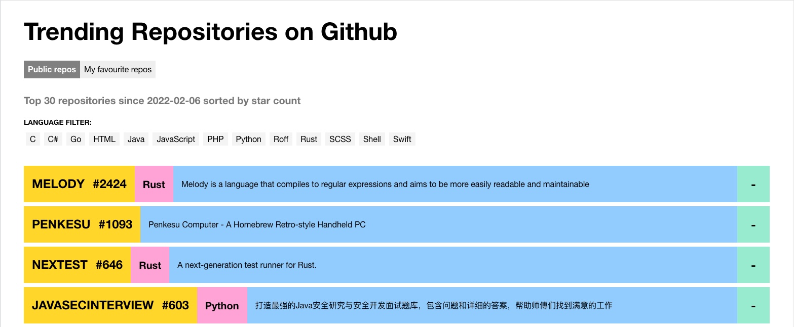

# Trending Repositories on Github

This project list of the repositories created in the last 7 days with the most number of stars in
github should be displayed and the user should be able to favourite them.

The favourited repositories should be visible either through a filter or in a different
tab. Some basic info about the repo should be displayed, such as: repo name, link
to GitHub, description and number of stars.
To keep things simple, the favourites won’t be sent back to GitHub’s servers but just
stored locally (e.g localstorage, cookies etc...).

## Available Scripts

In the project directory, you can run:

### `npm start`

Runs the app in the development mode.\
Open [http://localhost:3000](http://localhost:3000) to view it in the browser.

The page will reload if you make edits.\
You will also see any lint errors in the console.

### `npm test`

Launches the test runner in the interactive watch mode.\
See the section about [running tests](https://facebook.github.io/create-react-app/docs/running-tests) for more information.

### `npm run build`

Run the script `npm run lint` and thend builds the app for production to the `build` folder.\
It correctly bundles React in production mode and optimizes the build for the best performance.

The build is minified and the filenames include the hashes.\
Your app is ready to be deployed!

### `npm run lint`
Run ts-standard on `src/` .

### `npm run lint:fix`
Run ts-standard on `src/` and fix issues.

---
This project was bootstrapped with [Create React App](https://github.com/facebook/create-react-app).
